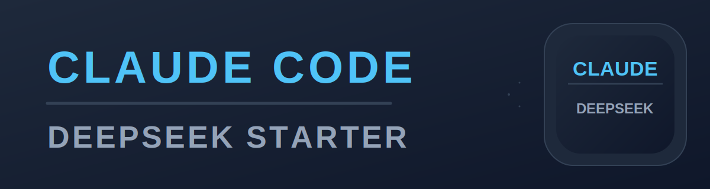

# Claude Code + DeepSeek Starter

English · [中文版](README.zh.md)

🌏 Don't see your language? Open a PR to add one — all welcome.

A cross-platform one-click deployment pack for regular users: quickly install Claude Code and forward its requests to the DeepSeek API.

Supported platforms:

- **macOS**: double-click to install, auto-installs Miniforge isolated environment.
- **Windows**: double-click to install, auto-prepares Git for Windows, Node.js LTS, and desktop shortcuts.
- **Linux/Ubuntu**: one-line CLI install, suitable for servers, dev machines, and WSL.

Official Claude Code setup docs: [Anthropic Claude Code setup](https://docs.anthropic.com/zh-CN/docs/claude-code/setup). This project uses the npm install route, with scripts handling cross-platform dependencies and environment variables.

## What You Need

- A macOS, Windows 10/11, or Linux/Ubuntu machine.
- A DeepSeek API Key.
- Network access to GitHub, npm, and the DeepSeek API.
- Windows users: a normal admin account is recommended so `winget` can install Git and Node.js.

## Quick Start

Clone or download this repo:

```bash
git clone https://github.com/Liujingze11/claude-deepseek-starter.git
cd claude-deepseek-starter
```

Then pick your platform:

| System | Recommended Entry | Best For |
| --- | --- | --- |
| macOS | `macos/install.command` | Users who don't want to manually install Homebrew, Node, or npm |
| Windows | `windows/setup.bat` | Users who want double-click install and desktop launch |
| Linux/Ubuntu | `linux/install.sh` | Terminal users, servers, WSL users |

During installation you will be prompted for your DeepSeek API Key. The input will not be displayed on screen — this is normal. The key is only written to your local `.env` file.

## Platform Selection Guide

| Scenario | Recommended | Notes |
| --- | --- | --- |
| macOS Apple Silicon M1/M2/M3/M4 | `macos/install.command` | Auto-installs arm64 Miniforge |
| macOS Intel | `macos/install.command` | Auto-installs x86_64 Miniforge |
| Windows 10/11 regular user | `windows/setup.bat` | Git for Windows route, no WSL needed |
| Windows user already familiar with WSL | `linux/install.sh` | Install inside WSL Ubuntu, Linux-style |
| Ubuntu/Debian desktop or server | `linux/install.sh` | Installs Miniforge, Node.js, Claude Code |
| Other Linux distros | Reference `linux/install.sh` | Needs `bash` and `curl`; package manager differences may need manual handling |

## macOS Install

1. Open the `macos` folder.
2. Double-click `install.command`.
3. If macOS warns "cannot be opened", right-click `install.command`, select "Open", then click "Open".
4. Enter your DeepSeek API Key when prompted.
5. After installation, double-click `Claude Code DeepSeek` on the desktop and select your project folder.

See [macos/README.md](macos/README.md)

Terminal users can also launch like this:

```bash
cd /path/to/your/project
claude-deepseek
```

## Windows Install

1. Open the `windows` folder.
2. Double-click `setup.bat`.
3. Enter your DeepSeek API Key when prompted.
4. After installation, double-click `Claude Code DeepSeek` on the desktop and select your project folder.

See [windows/README.md](windows/README.md)

PowerShell users can also launch like this:

```powershell
claude-deepseek C:\Users\me\projects\my-project
```

## Linux/Ubuntu Install

```bash
cd linux
chmod +x install.sh run-claude.sh verify-deepseek.sh
./install.sh
```

See [linux/README.md](linux/README.md)

To use, enter any project directory and run:

```bash
cd ~/projects/my-project
claude-deepseek
```

## Verify DeepSeek Connection

macOS:

```bash
cd macos
./verify-deepseek.command
```

Windows:

```powershell
cd windows
powershell -ExecutionPolicy Bypass -File .\verify-deepseek.ps1
```

Linux/Ubuntu:

```bash
cd linux
./verify-deepseek.sh
```

If the output contains `DeepSeek OK`, the API is connected.

## Configuration

Each platform directory has its own `.env.example`. On first install the script copies it to `.env` and writes your DeepSeek API Key.

Common configuration:

```text
ANTHROPIC_BASE_URL=https://api.deepseek.com/anthropic
ANTHROPIC_AUTH_TOKEN=sk-your-deepseek-key
ANTHROPIC_MODEL=deepseek-v4-pro[1m]
ANTHROPIC_DEFAULT_OPUS_MODEL=deepseek-v4-pro[1m]
ANTHROPIC_DEFAULT_SONNET_MODEL=deepseek-v4-pro[1m]
ANTHROPIC_DEFAULT_HAIKU_MODEL=deepseek-v4-flash
CLAUDE_CODE_SUBAGENT_MODEL=deepseek-v4-flash
CLAUDE_CODE_EFFORT_LEVEL=max
```

To switch keys or models, edit the `.env` file in the corresponding platform directory.

## Repo Structure

```text
.
├── README.md
├── docs/
│   ├── publish-checklist.md
│   └── troubleshooting.md
├── linux/
│   ├── install.sh
│   ├── run-claude.sh
│   └── verify-deepseek.sh
├── macos/
│   ├── install.command
│   ├── run-claude.command
│   └── verify-deepseek.command
└── windows/
    ├── setup.bat
    ├── install.ps1
    ├── run-claude.ps1
    └── verify-deepseek.ps1
```

## Claude Code Version Compatibility

Claude Code is frequently updated by Anthropic. New versions may introduce changes that temporarily break compatibility with DeepSeek's Anthropic-compatible API. If this happens, **downgrade to the last known working version** to restore functionality.

macOS / Linux:

```bash
conda activate claude-code-deepseek
npm install -g @anthropic-ai/claude-code@<known-working-version>
```

Windows (PowerShell):

```powershell
npm install -g @anthropic-ai/claude-code@<known-working-version>
```

After downgrading, functionality will return to normal. Once DeepSeek completes compatibility work and confirms a new version works, re-run the platform install script to upgrade to the latest. This README will be updated with the currently recommended working version when available.

## FAQ

### 1. Why don't I see characters when typing my API Key?

Normal. The script uses hidden input to prevent the key from appearing on screen. Paste and press Enter.

### 2. After install, `claude-deepseek: command not found`

macOS/Linux: `~/.local/bin` is likely not in your PATH.

zsh users:

```bash
echo 'export PATH="$HOME/.local/bin:$PATH"' >> ~/.zshrc
source ~/.zshrc
```

bash users:

```bash
echo 'export PATH="$HOME/.local/bin:$PATH"' >> ~/.bashrc
source ~/.bashrc
```

Windows users: close and reopen PowerShell or the install window. If it still doesn't work, restart your machine.

### 3. macOS says "cannot open install.command"

This is macOS Gatekeeper warning for unsigned scripts. Right-click `install.command`, select "Open", then click "Open" again.

If it still won't open, run in Terminal:

```bash
cd macos
chmod +x install.command run-claude.command verify-deepseek.command
./install.command
```

### 4. Windows `setup.bat` flashes and closes immediately

Run manually in PowerShell to see the full error:

```powershell
cd windows
powershell -NoProfile -ExecutionPolicy Bypass -File .\install.ps1
```

Common causes: `winget` not available, or PATH not refreshed after Git/Node install. Try restarting first.

### 5. Windows says `winget` not found

`winget` comes from the Microsoft Store "App Installer". Update or install "App Installer" from the Microsoft Store first.

If your company disables the Microsoft Store, ask IT to install:
- Git for Windows
- Node.js LTS (18 or later)

Then run `setup.bat` again.

### 6. Windows: Git for Windows or WSL?

Regular users should use `windows/setup.bat` — the Git for Windows route, double-click.

Developers already using WSL daily can use the Linux version inside WSL Ubuntu:

```bash
cd linux
./install.sh
```

Do not run Linux scripts from Windows PowerShell.

### 7. Linux says `curl` not found

Ubuntu/Debian:

```bash
sudo apt-get update
sudo apt-get install -y curl
```

Without sudo, ask an admin to install curl first.

### 8. conda environment creation fails

Check network access to GitHub and conda-forge. Corporate networks may need a proxy:

```bash
export HTTPS_PROXY=http://proxy-address:port
export HTTP_PROXY=http://proxy-address:port
```

Then re-run the install script. macOS/Linux environment name is `claude-code-deepseek` by default; re-running reuses the existing environment.

### 9. npm install of Claude Code fails

Usually an npm network issue. Configure npm proxy:

```bash
npm config set proxy http://proxy-address:port
npm config set https-proxy http://proxy-address:port
```

Then re-run the install script.

### 10. `verify` script does not return `DeepSeek OK`

Check in order:

1. Is `.env` present in the platform directory?
2. Is `ANTHROPIC_AUTH_TOKEN` set to your real DeepSeek API Key?
3. Is `ANTHROPIC_BASE_URL` set to `https://api.deepseek.com/anthropic`?
4. Can your network reach the DeepSeek API?
5. Does your API Key have quota / permissions?

### 11. How to change my DeepSeek API Key?

Edit `.env` in the corresponding platform directory:

```text
ANTHROPIC_AUTH_TOKEN=sk-your-new-key
```

Save and re-run `claude-deepseek`.

### 12. How to change the model version?

Edit `.env` in the corresponding platform directory:

```text
ANTHROPIC_MODEL=deepseek-v4-pro[1m]
ANTHROPIC_DEFAULT_OPUS_MODEL=deepseek-v4-pro[1m]
ANTHROPIC_DEFAULT_SONNET_MODEL=deepseek-v4-pro[1m]
ANTHROPIC_DEFAULT_HAIKU_MODEL=deepseek-v4-flash
CLAUDE_CODE_SUBAGENT_MODEL=deepseek-v4-flash
```

If DeepSeek changes model names in the future, just update these — no script changes needed.

### 13. How to upgrade Claude Code?

Re-run the platform install script:

- macOS: double-click `macos/install.command`
- Windows: double-click `windows/setup.bat`
- Linux: run `./install.sh` inside `linux/`

The script reuses existing configuration and performs an update install of Claude Code.

### 14. How to uninstall?

macOS/Linux:

```bash
conda env remove -n claude-code-deepseek
rm -f ~/.local/bin/claude-deepseek
```

On macOS, also remove the desktop launcher: `rm -rf ~/Desktop/"Claude Code DeepSeek.app"`

Windows:

- Delete `%USERPROFILE%\bin\claude-deepseek.cmd`
- Delete `Claude Code DeepSeek` from the desktop
- Delete the project folder

If you just want to stop using DeepSeek, delete the `.env` file in the platform directory.

### 15. `claude: command not found` — was working a second ago

This is a known Claude Code auto-update bug. Claude Code tries to update itself via npm in the background. npm renames the old package directory to a hidden temp name (e.g. `.claude-code-pLnB7FQW`) before replacing it — if this rename step fails due to leftover files or an interrupted update, the `claude` binary disappears from disk. The currently running process stays alive (code is already in memory), but the next launch fails.

**Symptoms:**

- `exec: claude: not found`
- `npm install -g @anthropic-ai/claude-code` fails with: `ENOTEMPTY: directory not empty, rename .../.claude-code-XXXXXX`

**Fix:**

```bash
# 1. Find corrupted temp directories left by the failed update
ls -d "$(npm root -g)"/.claude-code-* 2>/dev/null

# 2. Remove them
rm -rf "$(npm root -g)"/.claude-code-*

# 3. Reinstall Claude Code
npm install -g @anthropic-ai/claude-code
```

If you use the conda environment from this project:

```bash
conda activate claude-code-deepseek
rm -rf "$(npm root -g)"/.claude-code-*
npm install -g @anthropic-ai/claude-code
```

This issue has been reported by other Claude Code users — it's a problem with npm's global package update mechanism, not specific to this project or DeepSeek.
